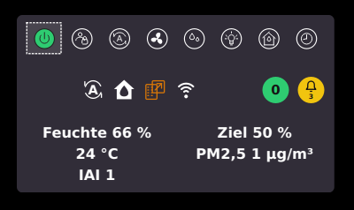
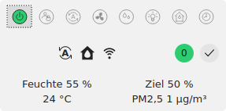
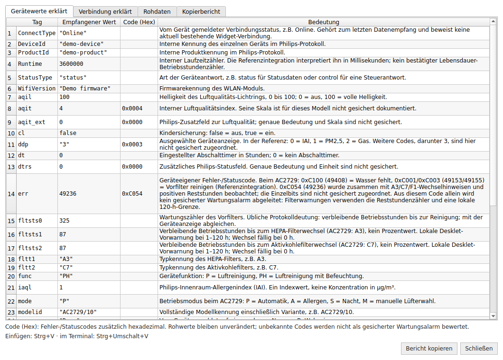

# AirCtrl-Desklet

**Dein Philips-Luftreiniger. Direkt auf dem Linux-Desktop.**

C++17 · Qt 6 · Lua 5.4 · TCP-Server/Clients · MIT · Version **v1.06**

[English](README.en.md) · [Bedienung](docs/USER_GUIDE.de.md) · [Entwicklung](docs/DEVELOPMENT.md) · [C++-API](docs/CPP_API.md) · [Änderungen](CHANGELOG.md)



*Echter Screenshot von Jürgen: Cinnamon unter X11, angepasste Farben und Schrift,
fünf Messwerte. Kein Design-Mockup.*

AirCtrl-Desklet ist ein schlankes Desktopwidget für den **Philips AC2729/10**.
Es verbindet die wichtigsten Gerätetasten mit aktuellen Messwerten, sichtbaren
Wartungshinweisen und einer verständlichen Verbindungsdiagnose. Die Steuerung
erfolgt im lokalen Netzwerk; das Programm benötigt kein Philips-Cloudkonto.

Es ist eine eigenständige Qt-Anwendung — **kein Cinnamon-JavaScript-Desklet**.
Das Verhalten auf der Desktop-Ebene hängt vom Fenstermanager ab.
Die Oberfläche ist derzeit deutschsprachig.

## Funktionen

- Acht Tasten: Ein/Aus, Kindersicherung, Automatik, Lüfter, Zielfeuchte, Licht,
  Luftreinigung/2-in-1 und Abschalttimer.
- Feuchte, Zielfeuchte, Temperatur, PM2,5 und IAI einzeln einblendbar.
- Aktive Modus- und Wartungssymbole aus bestätigten Statusmeldungen.
- Ein dauerhafter `airctrl-server` als einziger AC2729-Teilnehmer. Desklet,
  Lua und `airctrl-client` verwenden ausschließlich seine TCP-Schnittstelle.
- Genau eine UDP-I/O-Sitzung für alle Clients; automatische Erneuerung nur im
  Server, wenn 90 Sekunden lang keine Statusmeldung eingeht.
- Datenalter in Sekunden und separate Alarmglocke.
- Filtervorwarnungen, Quittierung, Desktop-Benachrichtigungen und optionaler Ton.
- Farben, Hintergrundtransparenz, Schrift, Fensterdekoration und Autostart im Kontextmenü.
- Diagnose mit deutschen Feldbeschreibungen, Hexcodes und kopierbarem Gesamtbericht.
- Sichere Lua-Automatik für Status-, Verbindungs-, Alarm- und Zeitereignisse,
  einschließlich Tag/Nacht-Zeitplänen.



*Helles Standardlayout, echte Qt-Demodarstellung ohne Geräteverbindung.
Ausgegraute Gerätetasten sind in der Demo absichtlich nicht bedienbar.*

## Schnellstart auf Fedora

Voraussetzungen: C- und C++17-Compiler, CMake ≥ 3.16, Qt ≥ 6.2 (Core/Gui/Widgets/DBus/Network),
OpenSSL Crypto, nlohmann/json ≥ 3.9 und Python 3 für den Installer.

```bash
sudo dnf install -y gcc-c++ cmake make qt6-qtbase-devel qt6-qtsvg \
  openssl-devel json-devel python3 dejavu-sans-fonts

# Im entpackten oder geklonten Projektverzeichnis:
bash install.sh
~/.local/bin/airctrl-desklet --demo
```

Die Geräteadresse steht ausschließlich in `/etc/airctrld.cfg`:

```ini
[server]
listen_address=0.0.0.0
port=5680

[device]
host=AC2729-10
port=5683
```

Im Desklet wird unter **Rechtsklick → Verbindung und Autostart** nur der
AirControl-Server eingetragen, standardmäßig `nadhh` und TCP-Port `5680`.
Der Client kennt weder Gerätehostname noch UDP-Port.

Installation unter `~/.local`, ohne `sudo` für das Installationsskript.
Menüeintrag: **Philips AirControl**. Bestehende Einstellungen bleiben erhalten.
Der Installer aktiviert außerdem den systemd-Benutzerdienst `airctrl-server`.
Ohne verfügbare systemd-Benutzersitzung muss `airctrl-server` separat gestartet werden.
Weitere Distributionen: [Build und Installation](docs/DEVELOPMENT.md).
Update und Entfernen: [Bedienungsanleitung](docs/USER_GUIDE.de.md).

Server und Kommandozeilen-Clients:

```bash
systemctl --user status airctrl-server.service
airctrl-client --host nadhh --port 5680 status
airctrl-client --host nadhh --port 5680 watch
airctrl-client --host nadhh --port 5680 set pwr=1
airctrl-client set mode=S om=s uil=0
airctrl-client refresh
```

Nur `airctrl-server` enthält die Philips-CoAP-Anbindung. Alle Clients sprechen
zeilenbasiertes JSON über TCP, standardmäßig mit `nadhh:5680`. Dieses Protokoll
hat keine eigene Anmeldung oder Verschlüsselung; Port 5680 darf in der Firewall
nur für vertrauenswürdige Rechner im lokalen Netz freigegeben werden.

## Bedienung

| Aktion | Bedienung |
|---|---|
| Kontextmenü | Per Maus ausschließlich Rechtsklick; alternativ Menütaste oder Umschalt+F10 |
| Verschieben | An Messwerten, Statussymbolen oder Kreisen ziehen; Positionssperre vorher lösen |
| Fensterrahmen | Kontextmenü → Fensterdekoration ausblenden |
| Diagnose | F1 oder Kontextmenü → Diagnose / Gerätedaten |
| Empfang neu starten | F5; im Normalbetrieb nicht erforderlich |
| Alarmdetails | Linksklick auf einen Statuskreis |
| Bericht kopieren | Diagnose → Bericht kopieren oder Strg+Umschalt+C |

Power bleibt anklickbar: **orange** ohne Verbindung, **weiß** bei ausgeschaltetem
und **grün** bei eingeschaltetem Gerät. Während eines laufenden Befehls werden
keine zusätzlichen Power-Befehle gesendet.

Links zählt der Kreis Sekunden seit dem letzten gültigen Datenpaket: standardmäßig
grün unter 45 s, gelb ab 45 s und rot ab 90 s. Rechts stehen Haken oder Alarmanzahl.
Die Kreise messen bei Standardschrift 26 px und wachsen mit der Schriftgröße.

## Lua-Automatik

Unter **Rechtsklick → Lua-Automatik** öffnet sich der integrierte Skripteditor.
Die Automatik ist nach Installation zunächst ausgeschaltet. Das mitgelieferte
Beispiel enthält als Kommentare die vollständige Ereignis-, Statusfeld- und
Steuerwertreferenz. Aktiv schaltet es täglich um 22:00 Uhr auf Nacht und um
07:00 Uhr auf Tag:

```lua
airctrl.schedule {
    name = "nacht", at = "22:00",
    days = {1, 2, 3, 4, 5, 6, 7},
    set = { mode = "S", om = "s", uil = "0" }
}

airctrl.schedule {
    name = "tag", at = "07:00",
    set = { mode = "P", uil = "1" }
}
```

`on_event(event)` erhält `startup`, `time`, `connected`, `disconnected`,
`status`, `alarm` und `command`. Statusereignisse enthalten den vollständigen
bestätigten Zustand in `event.status` sowie Änderungen in `event.changed`.
`airctrl.set { ... }` verwendet dieselbe Positivliste, IPC-Verbindung und
Bestätigungslogik wie die Gerätetasten. Pro Zeitplantermin gibt es höchstens einen Schaltversuch;
bereits passende Zustände erzeugen keinen Netzwerkbefehl.

Lua 5.4.9 wird aus dem geprüften offiziellen Quellstand eingebettet. Die Sandbox
stellt nur Basis-, Tabellen-, String-, Mathematik- und UTF-8-Funktionen bereit:
keine API für beliebige Datei-, Netzwerk- oder Prozesszugriffe und kein `io`,
`os`, `package`, `debug`, `dofile`, `loadfile` oder `load`. Nur `airctrl.set`
darf erlaubte Werte an das konfigurierte Gerät senden. Zusätzlich gelten 8 MiB
Speicher und 200.000 VM-Instruktionen je Aufruf. Das schützt vor vielen Fehlern,
macht fremde Skripte aber nicht automatisch vertrauenswürdig.
[Lua-API und Beispiele](docs/LUA_AUTOMATION.md)

### Wartung

| Code | Bedeutung | Reststundenzähler |
|---|---|---|
| A3 | HEPA-Filter wechseln | `fltsts1` |
| C7 | Aktivkohlefilter wechseln | `fltsts2` |
| F1 | Befeuchtungsdocht wechseln, nicht reinigen | `wicksts` |
| F0 | Vorfilter / Befeuchtungselement reinigen | `fltsts0` und bekannte Reinigungscodes |

Für AC2729 zeigt das Desklet je Filter eine gelbe Vorwarnung bei **1–120
Restbetriebsstunden**, bei **0 h** einen roten Alarm. **120 h ist eine lokale
Desklet-Grenze, keine gesichert dokumentierte Philips-Frühwarnschwelle.**
Unbekannte Fehlerbits werden nicht geraten; `0xC054` allein erzeugt keinen Alarm.
Quittieren verändert keine Geräteeinstellung und setzt keinen Filterzähler zurück.
Die Geräteanzeige bleibt maßgeblich.

## Diagnose, die Rohwerte erhält



*Aus der tatsächlichen Qt-Oberfläche mit neutralen Testdaten gerendert.
Keine persönlichen Gerätekennungen im öffentlichen Bild.*

Gerätewerte, Verbindung, Roh-JSON und Kopierbericht haben eigene Reiter.
„Bericht kopiert“ bestätigt die lokale Übergabe. Einfügen: Strg+V, im Terminal
Strg+Umschalt+V; Mittelklick, falls Qt die PRIMARY-Auswahl unterstützt.
Vor dem Teilen Gerätekennungen, Namen, Netzwerkadressen und lokale Pfade entfernen.
[Sicher melden](SECURITY.md)

## Kompatibilität und Testgrenzen

Die beiden Gerätemitschnitte vom **8. September 2026** bestätigen den v1.04-
Ablauf: **148 gültige Statusmeldungen**, **17 von 17 angenommene Schaltbefehle**
mit passender nächster Statusmeldung nach **45–97 ms** und kein neuer UDP-Port
oder Sync beim Schalten. Nach **90 s** ohne Status wird die alte Beobachtung
abgemeldet; knapp 10 s später beginnt eine neue Sitzung. Im beobachteten Fall
treffen nach insgesamt **136,1 s** wieder Daten ein. 90 s ist die Fehlerfrist,
keine Zusage, dass dann bereits neue Daten vorliegen.

Observe wird beim Schalten kurz ab- und wieder angemeldet, während der Socket
bestehen bleibt. Eine 65,8-s-Pause bei ausgeschaltetem Gerät führt zu keinem
Neustart. Zwischen den beiden Aufzeichnungen fehlen knapp neun Minuten; die
Ursache der langen Sendepause ist nicht geklärt.
[Paketbelege, Zähler und Grenzen](docs/PROTOCOL_VALIDATION_2026-09-08.md)

| Umgebung | Stand |
|---|---|
| Philips AC2729/10 | v1.04: gemeinsamer UDP-Port, 17 Schaltungen und Wiederanlauf nach Status-Timeout im Gerätemitschnitt bestätigt |
| Server/Clients v1.06 | TCP-Mehrclientbetrieb, zentrale `/etc/airctrld.cfg` und echter UDP-Simulator lokal geprüft; echter Gerätebetrieb muss nach dem Einspielen bestätigt werden |
| Fedora 44 / Cinnamon / X11 (`xcb`) | Vom Nutzer bestätigt, einschließlich Diagnoseexport von v1.01 |
| Wayland | Angepasste Fensterbehandlung vorhanden; kein vollständiger nativer Desktop-Test bestätigt |
| Andere Philips-Modelle | Nicht freigegeben; Modellzuordnungen und Befehle können abweichen |

Qt wählt normalerweise das passende Fenster-Backend selbst. Wayland nicht
erzwingen, wenn kein entsprechender Sitzungssocket verfügbar ist.
Die lokale Prüfhistorie steht in [VALIDATION.md](VALIDATION.md), die vorbereitete
CI in [.github/workflows/ci.yml](.github/workflows/ci.yml). Ein vorbereiteter Workflow
ist noch kein erfolgreicher GitHub-Lauf.

## Entwickeln und beitragen

```bash
cmake --preset dev
cmake --build --preset dev --parallel 2
ctest --preset dev
python3 scripts/check_repository.py
```

Presets benötigen CMake ≥ 3.21 und Ninja. Klassischer Build ohne Presets:
[Entwicklungsleitfaden](docs/DEVELOPMENT.md). [Beiträge](CONTRIBUTING.md) ·
[Architektur und Protokollgrenzen](docs/ARCHITECTURE.md)

## Menschen, KI und Herkunft

| Beteiligter | Rolle |
|---|---|
| **Jürgen Sievers** | Projektinitiator, Product Owner und Maintainer; Anforderungen, Bedienkonzept, Prioritäten, Gerätetests und Freigaben |
| **OpenAI Codex** | KI-Entwicklungspartner; gemeinsame C++-/Qt-/Lua-Implementierung, Protokollanalyse, Fehlersuche, Tests und Dokumentation |
| **betaboon** | Autor des Python-Projekts `aioairctrl`, Grundlage der internen C++-Geräteanbindung im Server |

Entstanden im gemeinsamen, iterativen Entwickeln — vom ersten funktionierenden
Statusabruf bis zum alltagstauglichen Desktopwidget. Codex wird transparent als
KI-Unterstützung genannt, nicht als menschlicher Maintainer oder Supportkontakt.
Entscheidungen und Veröffentlichung liegen bei Jürgen. [Credits](AUTHORS.md)

## Lizenz und Unabhängigkeit

[MIT](LICENSE). Die ursprünglichen MIT-Hinweise von betaboon bleiben erhalten.
[Herkunft und Abhängigkeiten](THIRD_PARTY_NOTICES.md). Systembibliotheken und
Schriftarten haben eigene Lizenzbedingungen und sind nicht im Quellarchiv enthalten.

Unabhängiges Community-Projekt, kein offizielles Produkt von Philips, Versuni oder
OpenAI. Produktnamen beschreiben die Kompatibilität. Keine Cloudanmeldung, aber
auch kein Ersatz für sichere Netzwerkgrenzen: den Geräteport nicht ins Internet weiterleiten.

Für den ersten Upload: [GitHub vorbereiten und veröffentlichen](docs/GITHUB_SETUP.md).
